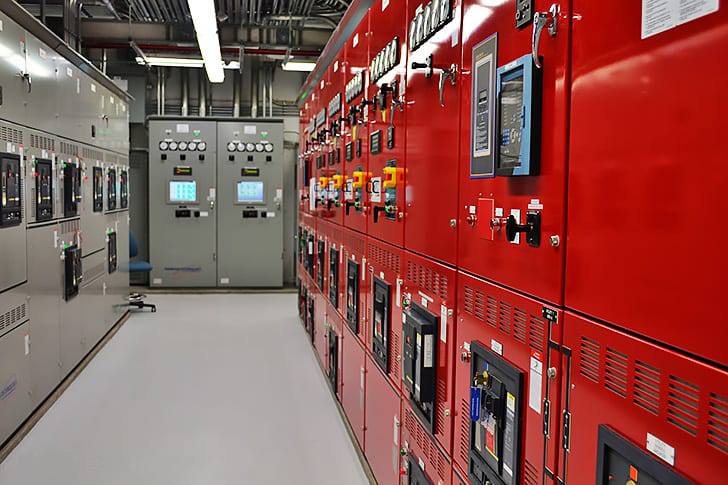

# dominandoMarkdown
# Comandos Básicos do MarkDown

## Criando um menu
# Menu

(Headings)[#headins]
(Formatação de Texto)[#formatação-de-texto]
(Imagens e links)[#imagens-e-links]

## Headins

# H1
## H2
### H3
#### H4
##### H5
###### H6
Formatação de Texto
## 
Use dois asteriscos para deixar a palavra ou a frase em **negrito**

Use o underlina para deixar a palavra ou frase em _itálico_

Também pode usar a _**concatenação**_ das tags

## Imagens e links

### Imagens
Para imagens coloque o sinal de exclamação e depois entre colchetes adicione o título da imagem e entre parentes o link da imagem



### Links
Para adicionar links é só remover a exclaamação

[link instagram](https://www.instagram.com/leo.c.lobo/)

## Trabalhando com listas

### Não ordenadas
 * item 1 
 * item 2
 * Item 3

### Listas Ordenadas
1. item 1
2. item 2
3. item 3

## Criando uma task list

- [ ] Item 1
- [x] Item 2
- [ ] Item 3

Danso dois enters e dois tabs abaixo do item, criamos um sub item

1. item 1.

        1. subitem 1
        2. subitem 2


2. Item 2.
3. Item 3.

## Blockquote

> Este é um bloquote usado para destacar alguma área
> 
> Use uma tag em branco para pular linha dentro do bloquote

## Colocando um trecho de código
```
<h1>
    colocando um trecho de código sem hilight da linguagem
</h1>

```
```js
    function showName(name){
        return 'Bem vindo ' + name
    }
```

## Trabalhando com tabelas

Nome | número | nota
-----|--------|------
Leonardo | 13| 10
luciano | 12 | 9
